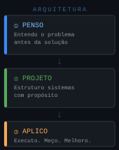
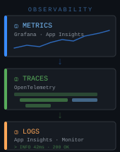
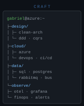
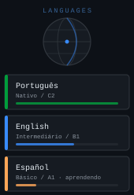

  

  
  
  
  

---

---

## Sobre mim

Desenvolvedor desde os tempos de ensino técnico em informática e Arquiteto de Soluções no dia a dia. Minha história com tecnologia começou na curiosidade de entender como as coisas funcionam por baixo do capô, e essa mesma motivação é o que me move até hoje.

Passei por todas as etapas da engenharia de software — do código do dia a dia ao desenho de arquiteturas complexas e governança em nuvem. O que mais gosto na área é resolver problemas difíceis de forma simples: transformar gargalos em soluções elegantes e ver sistemas rodando com alta performance e estabilidade.

**Como penso sobre arquitetura:** complexidade não deveria aparecer na superfície. O trabalho de um bom sistema é fazer algo difícil parecer simples pra quem usa — e invisível pra quem paga a conta de cloud.

 

---

## No momento

Arquiteto em evolução contínua — cada sistema entregue é uma oportunidade de aprender o que realmente funciona em escala real. Além das entregas técnicas do dia a dia, estou investindo em:

- **Pensamento estratégico** — conectar decisões de arquitetura ao impacto de negócio. Todo trade-off técnico carrega um custo operacional e um risco de produto que precisa ser comunicado com clareza.
- **Comunicação de arquitetura** — apresentar sistemas complexos para diferentes audiências: times de engenharia, gestão e stakeholders. Tornar o invisível visível.
- **Liderança técnica** — code governance, mentoria, padronização e construção de cultura de engenharia através de boas decisões de design.
- **Cloud-native em profundidade** — resiliência, escalabilidade e FinOps como requisitos de design, não como otimização tardia.

 

  

---

## Stack e ferramentas

Vivo no ecossistema **.NET (C#)** e **Microsoft Azure**. No dia a dia, Clean Architecture e DDD para manter sistemas grandes organizados, Azure Service Bus e RabbitMQ para comunicação assíncrona, e EF Core com SQL Server e PostgreSQL no lado dos dados.

Para observabilidade, OpenTelemetry como base de instrumentação e Grafana para visualização. Pipelines no Azure DevOps com GitFlow — e quando algo leva mais de 5 minutos sem motivo, vira um item de otimização.

 

  
  
  
  
  
  
  
  
  
  
  
  

---

## Idiomas

Comunicação técnica em três idiomas — essencial pra trabalhar com documentação internacional, arquiteturas de referência e times distribuídos.

**Português** — Nativo. Toda a comunicação do dia a dia, documentação técnica, code review e apresentações de arquitetura.

**English** — Intermediário (B1). Leitura e escrita técnica: RFCs, docs de plataforma, issues, PRs e comunicação com fornecedores. Em evolução ativa.

**Español** — Básico (A1). Frases e vocabulário fundamentais. Aprendendo ativamente.

 

---

## Projetos em destaque

  

Repositórios sendo organizados e documentados para publicação pública. A maioria do trabalho relevante vive em ambientes privados — arquiteturas, integrações e sistemas de produção que não cabem num repo aberto. Em breve, projetos selecionados por aqui.

  

Gerenciador de tarefas pessoal integrado ao **Notion API** construído em C# e .NET. Conecta diretamente à workspace do Notion para criar, listar e gerenciar tasks sem sair do terminal — menos fricção, mais foco.

  

API de gerenciamento de transferências financeiras em **.NET e C#** com foco em consistência de dados e operações seguras. Arquitetura pensada para rastreabilidade e auditoria das transações.

---

  <table role="presentation" cellspacing="0" cellpadding="0" border="0">
    <tr>
      <td align="center" valign="top">
        
      </td>
      <td align="center" valign="top">
        
      </td>
    </tr>
  </table>

---

  

  
  &nbsp;
  
  &nbsp;
  
  &nbsp;
  

